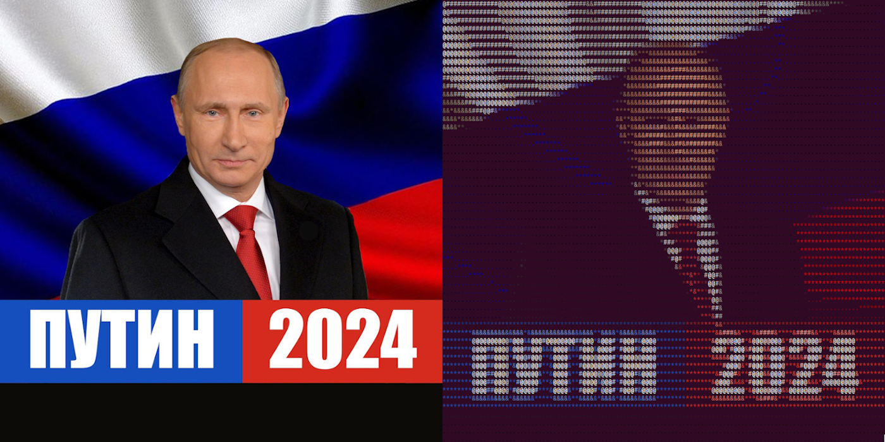

## Summary

This is a lightweight library for turning images to grid of ascii tokens.
Visual example:


## Installation 

The simplest and recommended way to install this package is to install
it with PyPI:
```
pip install ascify
```

To install from source, do:
```
git clone https://github.com/theonekeyg/ascify.git && cd ascify
pip install .
```

## Usage

### Basic usage
The simplest usage, with only default parameters would look like this:
```python
from ascify.grid import AsciiGrid

grid = AsciiGrid("./sample_image.png")
grid.start()
print(grid)
```

### Configurability
Ascify framework is highly configurable, you can change output grid size,
size of the moving window through the original image, output ascii tokens and
logic behind choosing tokens for particular window (which i call renditions).
All renditions take numpy.array of size (step, step, 3) as their first parameter,
which represents the moving window at certain position on the image.
Examples of implemented renditions can be found in `./ascify/renditions.py`
file. For instance, default rendition looks the following:
```python
def default_rendition(img_slice, ascii_tokens):
    for char, threshold in ascii_tokens.items():
        if (img_slice.mean() >= threshold):
            return char
```

Besides of configuring rendition itself, you can configure ascii tokens, used
for the output ascii grid. The tokens are passed directly to the rendition and
don't participate in any other part of ascify, so the format of ascii tokens
depends only on the logic of corresponding rendition used with it.

However, if you use one of the default renditions, the expected tokens format
is object with implemented `__getitem__` method, keys to which represens tokens
themselves, and values represent threshold values. The default token dictonary
looks the following:

```python
default_tokens = {
    "@": 200,
    "#": 155,
    "&": 100,
    "*": 50,
    ".": 0
}
```
